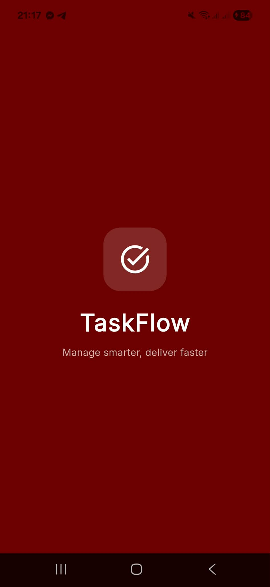
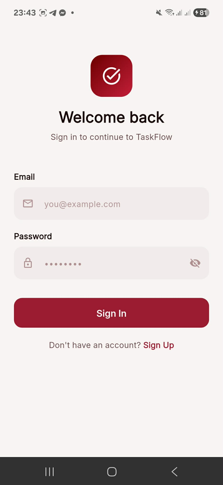
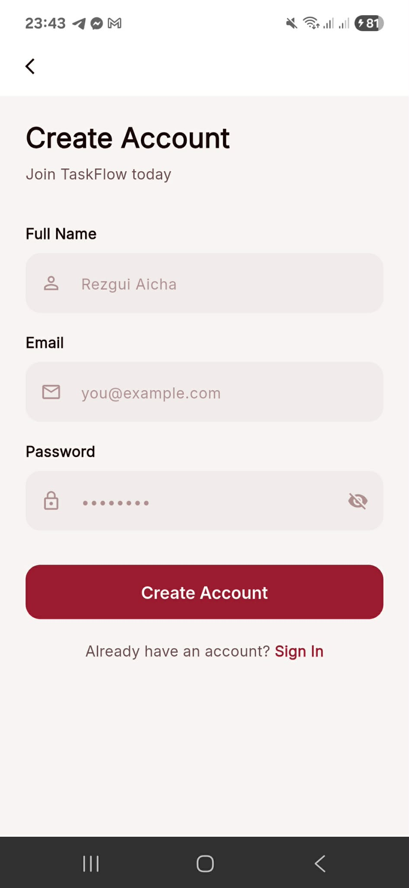
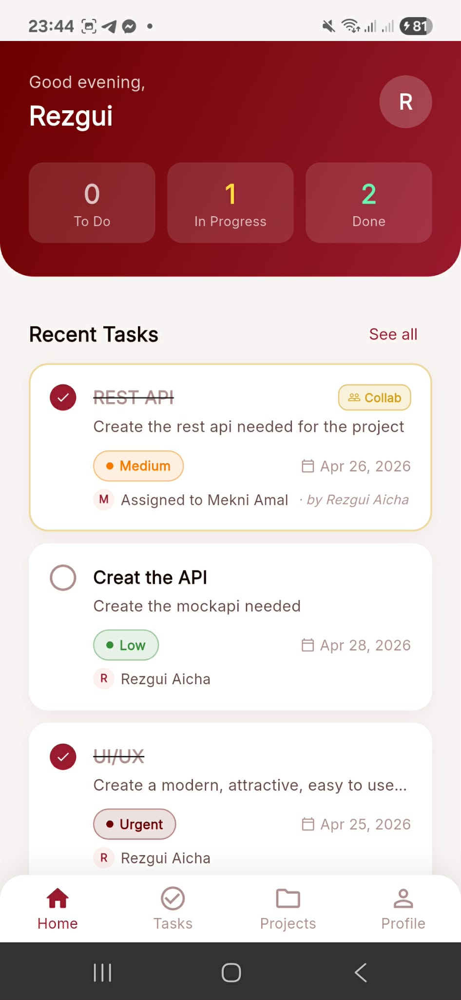
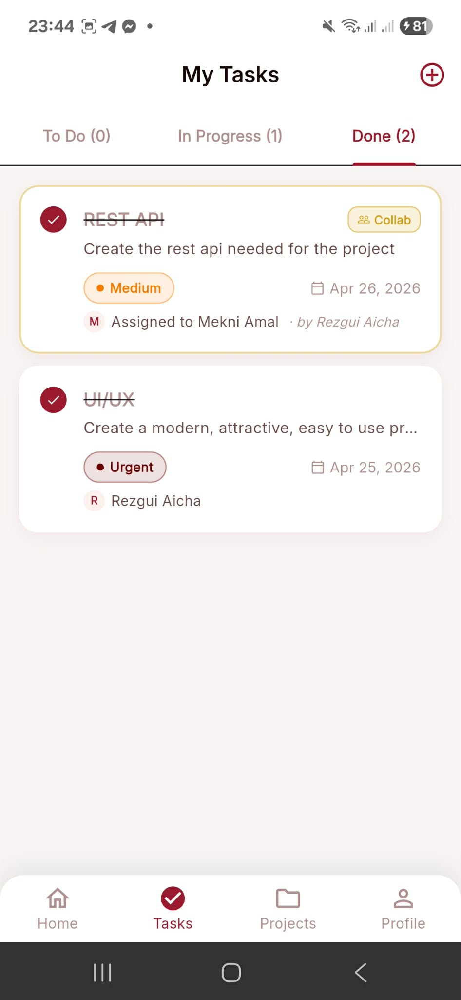
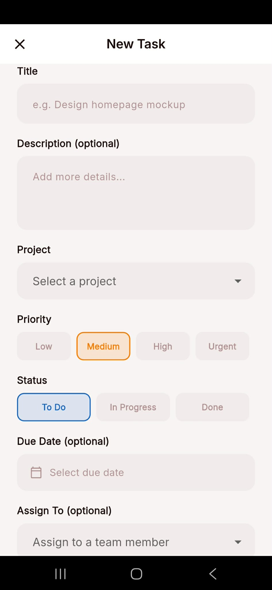
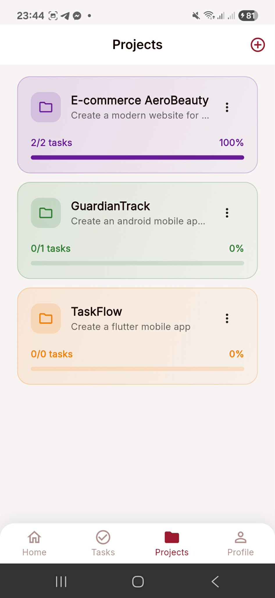
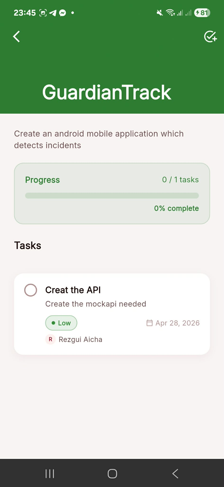
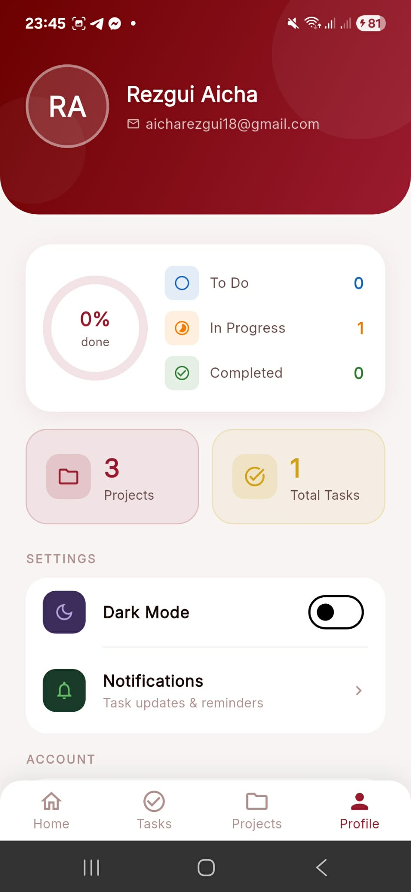

# TaskFlow 📋

> **Manage smarter, deliver faster**

A modern mobile task management application built with Flutter, featuring clean architecture, collaborative task assignment, and real-time state management.

---

## 📱 Screenshots

<table>
  <tr>
    <td align="center">
      <br/>
      <sub><b>Splash Screen</b></sub>
    </td>
    <td align="center">
      <br/>
      <sub><b>Login</b></sub>
    </td>
    <td align="center">
      <br/>
      <sub><b>Register</b></sub>
    </td>
  </tr>
  <tr>
    <td align="center">
      <br/>
      <sub><b>Dashboard</b></sub>
    </td>
    <td align="center">
      <br/>
      <sub><b>Tasks</b></sub>
    </td>
    <td align="center">
      <br/>
      <sub><b>Create / Edit Task</b></sub>
    </td>
  </tr>
  <tr>
    <td align="center">
      <br/>
      <sub><b>Projects</b></sub>
    </td>
    <td align="center">
      <br/>
      <sub><b>Project Detail</b></sub>
    </td>
    <td align="center">
      <br/>
      <sub><b>Profile</b></sub>
    </td>
  </tr>
</table>

---

## ✨ Features

### Core
- 🔐 **Simplified Authentication** — Register & login with JWT token persistence
- ✅ **Task Management (CRUD)** — Create, read, update, delete tasks
- 📁 **Project Management** — Organize tasks into color-coded projects
- 👥 **Collaboration** — Assign tasks to team members with visual indicators
- 📊 **Progress Tracking** — Visual progress bars and completion statistics
- 🌙 **Dark Mode** — Full dark theme support

### Task Features
- Priority levels: Low / Medium / High / Urgent
- Status tracking: To Do → In Progress → Done
- Due date with overdue detection
- Collaborative badge for shared tasks
- Swipe to delete

### Bonus
- 🔔 **Local Notifications** — Triggered when a task is marked as Done
- 📱 **Responsive UI** — SafeArea support for all screen types

---

## 🏛️ Architecture

This project follows **Clean Architecture + MVVM** principles with strict layer separation.

```
lib/
├── core/                   # Shared utilities
│   ├── constants/          # Colors, theme, strings
│   ├── di/                 # Dependency injection (GetIt)
│   ├── network/            # HTTP client (Dio)
│   ├── router/             # Navigation (GoRouter)
│   ├── services/           # Notification service
│   └── utils/              # Date formatting helpers
│
├── domain/                 # Business logic (pure Dart, no Flutter)
│   ├── entities/           # Core business objects
│   ├── repositories/       # Abstract contracts
│   └── usecases/           # One file per business action
│
├── data/                   # Data access implementation
│   ├── models/             # Entities + JSON serialization
│   ├── datasources/        # Remote API calls (Dio)
│   └── repositories/       # Repository implementations
│
└── presentation/           # UI layer
    ├── providers/          # ViewModels (Riverpod StateNotifier)
    ├── screens/            # Full pages
    └── widgets/            # Reusable components
```

### Data Flow

```
User Action → Screen → Provider (ViewModel)
           → UseCase → Repository (abstract)
           → RepositoryImpl → DataSource
           → REST API (Spring Boot)
           → PostgreSQL
           ↩ Response flows back up
           → State updated → UI rebuilds automatically
```

---

## 🛠️ Tech Stack

### Frontend — Flutter

| Package | Version | Purpose |
|---|---|---|
| `flutter_riverpod` | ^2.5.1 | State management (MVVM) |
| `go_router` | ^13.2.0 | Declarative navigation |
| `dio` | ^5.4.1 | HTTP client |
| `get_it` | ^7.6.7 | Dependency injection |
| `google_fonts` | ^6.2.1 | Inter font family |
| `flutter_slidable` | ^3.1.0 | Swipe-to-delete gesture |
| `percent_indicator` | ^4.2.3 | Progress bars |
| `flutter_local_notifications` | ^17.1.2 | Local push notifications |
| `permission_handler` | ^11.3.1 | Runtime permissions |
| `shared_preferences` | ^2.2.3 | Token & session persistence |
| `intl` | ^0.19.0 | Date formatting |

### Backend — Spring Boot

| Technology | Purpose |
|---|---|
| Spring Boot 3 | REST API framework |
| Spring Security | Authentication & authorization |
| JWT (jjwt) | Stateless token authentication |
| Spring Data JPA | Database ORM |
| PostgreSQL | Relational database |
| Lombok | Boilerplate reduction |

---

## 🚀 Getting Started

### Prerequisites

- Flutter SDK `>=3.0.0`
- Java 17+
- PostgreSQL 14+
- Android device or emulator (API 26+)

### 1. Clone the repository

```bash
git clone https://github.com/yourusername/taskflow.git
cd taskflow
```

### 2. Setup the Backend

```bash
cd taskflow-backend
```

Create the PostgreSQL database:

```sql
CREATE DATABASE taskflow;
CREATE USER taskflow_user WITH PASSWORD 'your_password';
GRANT ALL PRIVILEGES ON DATABASE taskflow TO taskflow_user;
```

Configure `src/main/resources/application.properties`:

```properties
spring.datasource.url=jdbc:postgresql://localhost:5432/taskflow
spring.datasource.username=taskflow_user
spring.datasource.password=your_password
spring.jpa.hibernate.ddl-auto=update
server.port=8080
server.address=0.0.0.0
jwt.secret=taskflow_super_secret_jwt_key
jwt.expiration=86400000
```

Start the backend:

```bash
./mvnw spring-boot:run
```

### 3. Setup the Flutter App

```bash
cd taskflow
flutter pub get
```

Update your local IP in `lib/core/network/api_client.dart`:

```dart
// For physical device → your machine's local IP
static const String baseUrl = 'http://192.168.1.X:8080/api';

// For Android emulator only
// static const String baseUrl = 'http://10.0.2.2:8080/api';
```

Run the app:

```bash
flutter run
```

---

## 🔌 API Endpoints

| Method | Endpoint | Description | Auth |
|---|---|---|---|
| `POST` | `/api/auth/register` | Create account | ❌ |
| `POST` | `/api/auth/login` | Sign in, get JWT | ❌ |
| `GET` | `/api/tasks` | Get visible tasks | ✅ |
| `POST` | `/api/tasks` | Create task | ✅ |
| `PUT` | `/api/tasks/{id}` | Update task | ✅ |
| `DELETE` | `/api/tasks/{id}` | Delete task | ✅ |
| `GET` | `/api/projects` | Get my projects | ✅ |
| `POST` | `/api/projects` | Create project | ✅ |
| `DELETE` | `/api/projects/{id}` | Delete project | ✅ |
| `GET` | `/api/users` | List all users | ✅ |

---

## 👥 Collaboration Logic

| Scenario | Visible to |
|---|---|
| Amal creates task → assigns to **Amal** | Amal only |
| Amal creates task → assigns to **Aicha** | Amal **and** Aicha |

Collaborative tasks are visually marked with a **Collab** badge and show both the creator and assignee names.

---

## 🎨 Design System

| Token | Value | Usage |
|---|---|---|
| `primaryDark` | `#6D0000` | Header gradients |
| `primary` | `#9B1B30` | Buttons, active states |
| `primaryLight` | `#C41E3A` | Dark mode accent |
| `accent` | `#D4A017` | Collaborative badges |
| `success` | `#2E7D32` | Done status |
| `warning` | `#F57C00` | In Progress, medium priority |
| `error` | `#D32F2F` | Overdue, delete actions |

---

## 📁 Project Structure Summary

```
taskflow/                   ← Flutter app
├── lib/
├── android/
├── screenshots/            ← App screenshots for README
└── README.md

taskflow-backend/           ← Spring Boot API
├── src/main/java/com/taskflow/
│   ├── controller/
│   ├── service/
│   ├── repository/
│   ├── model/
│   ├── dto/
│   ├── security/
│   └── config/
└── src/main/resources/
    └── application.properties
```

---

## 👤 Author

**REZGUI AICHA**
Student — Mobile Application Development Project
Academic Year 2025–2026